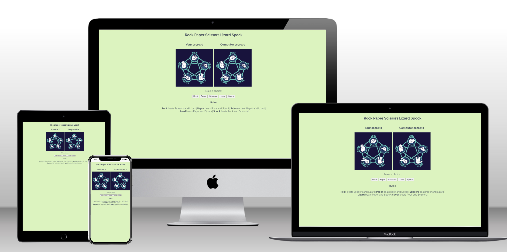

# Rock Paper Scissors Lizard Spock
Rock Paper Scissors Lizard Spock is a simple game that can be played by any age group. This site helps users to learn, practice decision-making, and have fun.

## Features
### Existing Features
- Header

Featured at the top of the page. The Header shows the game name.
- Game options

The Game options include a choice of options to choose from to play. There are 5 buttons: rock, paper, scissors, lizard and spock.

- Footer

The footer section shows the rules of the game.

- Credits

As a reference [Portfolio Project Scope](https://learn.codeinstitute.net/courses/course-v1:CodeInstitute+JSE_PAGPPF+2021_Q2/courseware/30137de05cd847d1a6b6d2c7338c4655/c3bd296fe9d643af86e76e830e1470dd/) of [Code Institute](https://learn.codeinstitute.net/dashboard) has been used and also codes has been taken.
